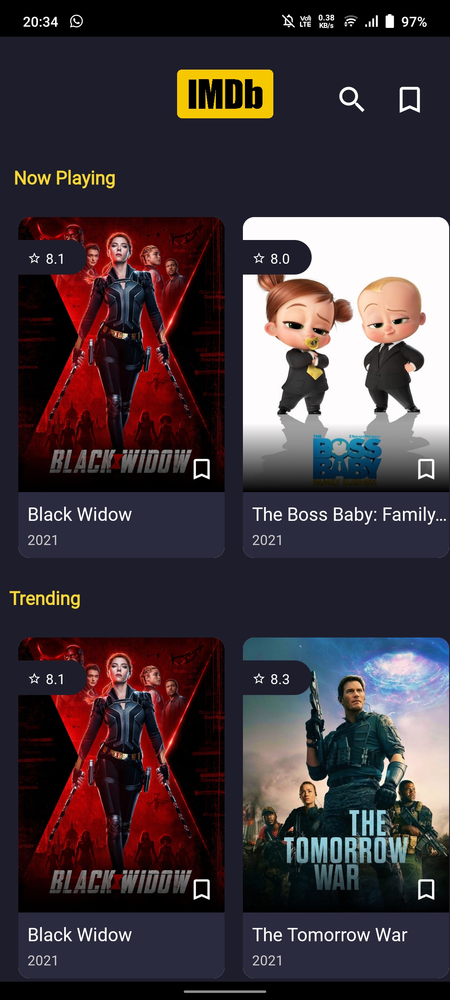
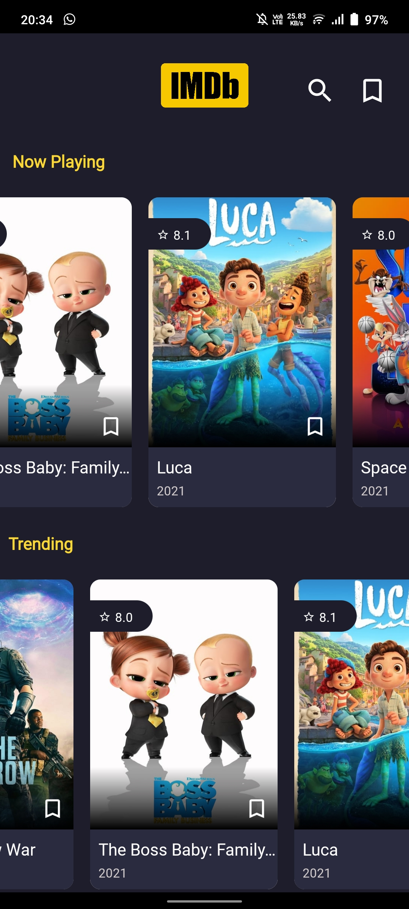
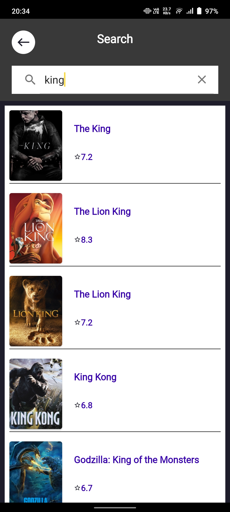
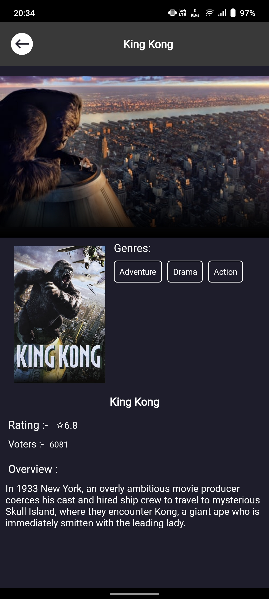
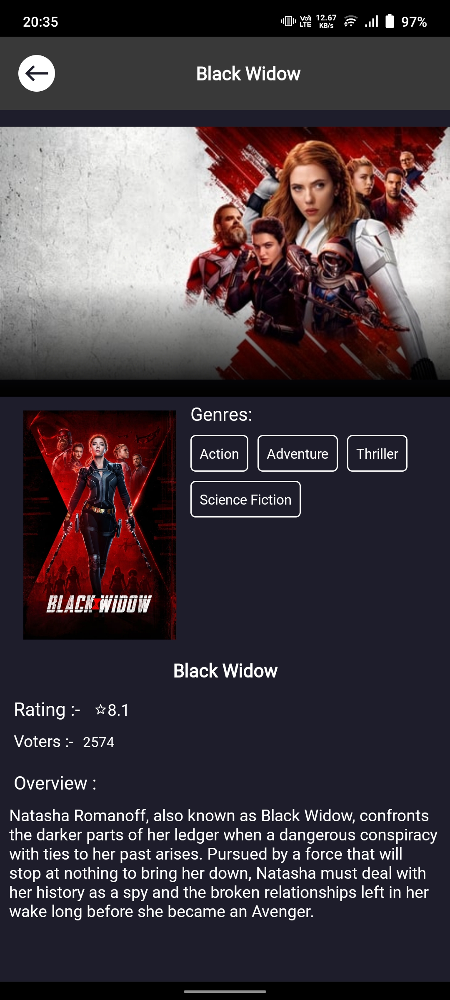
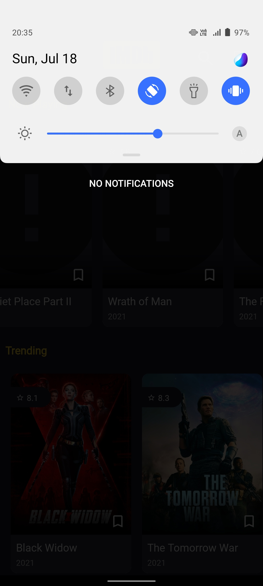
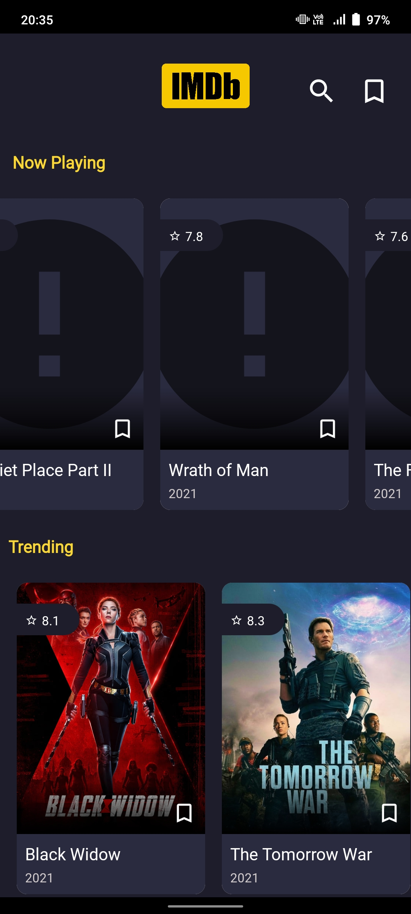
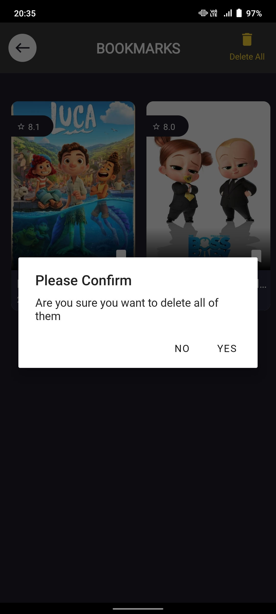
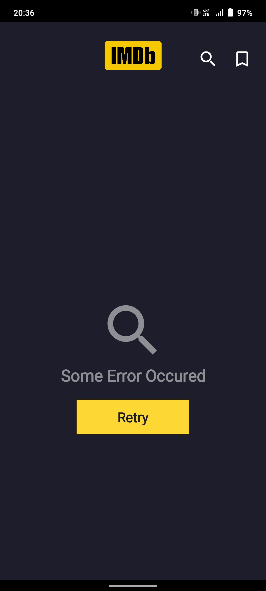

# IMDB-CLONE

A simple imdb clone using KOTLIN,MVVM with searching and bookmarking ability with offline caching ability

Libraries used:- Kotlin Coroutines,Room Database,Retrofit.

## screenshots

<table>
<tr>
    <td>Home Screen 1</td>
    <td>Home Screen 2</td>
  </tr>
  <tr>
    <td></td>
    <td></td>
  </tr>
<tr>
    <td>Bookmarked movies</td>
    <td>Bookmark Screens</td>
  </tr>
<tr>
    <td></td>
    <td></td>
  </tr>
<tr>
    <td>Search Screen</td>
    <td>Movie Detail Screen</td>
  </tr>
<tr>
    <td></td>
    <td></td>
  </tr>
<tr>
    <td>Movie Detail Screen</td>
    <td>Turning off internet</td>
  </tr>
<tr>
    <td></td>
    <td></td>
  </tr>
<tr>
    <td>Offline mode app</td>
    <td>Deleting saved bookmarks</td>
  </tr>
<tr>
    <td></td>
    <td></td>
  </tr>
<tr>
    <td>Empty bookmarks screen</td>
    <td>No internet screen</td>
  </tr>
<tr>
    <td></td>
    <td></td>
  </tr>
 </table>

